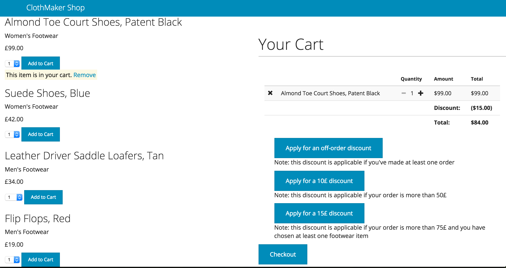

# Clothing Retailer Test
This project is a test to create an eCommerce/online clothing retailer website, with a catalogue and a shopping cart feature.

### Instructions
- Clone the repo
- In your command line, type: ``` npm install ``` to install Express and relative test frameworks
- type: ``` bower install ``` to install Bootstrap, Angular.js and ngCart 
- run feature tests by typing (if you have Selenium WebServer installed): ``` webdriver-manager update```, ``` webdriver-manager start ``` and ``` protractor conf.js ```
- run server tests by typing ``` node server.js ``` then ``` mocha test ```
- run client unit tests by typing ``` karma start ```
- With the server running, check website at the url ``` http://localhost:3000 ```
- You can find the API at the url ``` http://localhost:3000/api ```

### Directory tree
```
.
├── README.md
├── bower.json
├── conf.js
├── karma.conf.js
├── package.json
├── public
│   ├── css
│   │   ├── font-icons.css
│   │   └── style.css
│   ├── js
│   │   ├── angularApp.js
│   │   └── polyfill.js
│   └── template
│       └── ngCart
│           ├── addtocart.html
│           ├── cart.html
│           ├── checkout.html
│           └── summary.html
├── server.js
├── storage
│   └── products.json
├── test
│   ├── apiSpec.js
│   ├── features
│   │   └── ClothMakerAppFeaturesSpec.js
│   └── unit
│       └── ClothMakerAppSpec.js
└── views
    └── index.html
```

### User Stories
As a User I can view the products and their category, price and availability information.

- As a User I can add a product to my shopping cart.
- As a User I can remove a product from my shopping cart.
- As a User I can view the total price for the products in my shopping
cart.
- As a User I can apply a voucher to my shopping cart.
- As a User I can view the total price for the products in my shopping cart
with discounts applied.
- As a User I am alerted when I apply an invalid voucher to my shopping
cart.
- As a User I am unable to add "Out of Stock" products to the shopping cart.

### Technology
- Server-side: Node.js Express API server, serving a static JSON file.
- Client-side: Angular.js to query the API server for the catalogue, client-side business and view logic, ngCart module for Angular for the eCommerce-style shopping cart logic
- Styling: Bootstrap 3/Bootswatch Cerulean Theme

### Screenshot


